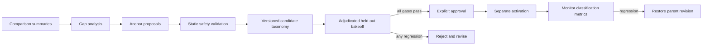

# Custom Anchor Engineering

Anchor engineering improves semantic-classifier coverage; it does not directly create a
suppression rule. Cascade keeps this lifecycle separate from nano-agent promotion so neither a
generated phrase nor classifier agreement can silently change production behavior.



## Public API

`cascade_compression.anchor_engineering` provides small, offline building blocks:

- `collect_gap_summary` aggregates fallback metadata without retaining signal payloads.
- `validate_anchor_proposals` rejects unsupported labels, duplicates, malformed text, and obvious
  incident language in suppressive anchors.
- `build_candidate_taxonomy` creates a content-addressed candidate with parent revision,
  additions, provenance, and approval requirements.
- `evaluate_holdout` measures accuracy, authority coverage, per-label recall, confusion, and
  authoritative false suppressions against adjudicated labels.
- `compare_evaluations` applies conservative no-regression and zero-false-suppression gates.
- `approve_candidate` records explicit approval but intentionally does not deploy anything.
- `rollback_revision` returns the immutable parent revision.

Example:

```python
from cascade_compression.anchor_engineering import (
    approve_candidate,
    build_candidate_taxonomy,
    compare_evaluations,
    evaluate_holdout,
    validate_anchor_proposals,
)

accepted, rejected = validate_anchor_proposals(
    proposals,
    gap_summary,
    current_taxonomy=current_taxonomy,
)
candidate = build_candidate_taxonomy(current_taxonomy, accepted)

current_result = evaluate_holdout(current_predictions)
candidate_result = evaluate_holdout(candidate_predictions)
comparison = compare_evaluations(current_result, candidate_result)

approved = approve_candidate(
    candidate,
    comparison,
    approved_by="reviewer",
)
```

The prediction rows supplied to `evaluate_holdout` contain a stable `record_id`, `expected`,
`predicted`, and `margin`. Cascade hashes the record IDs and expected labels so current and
candidate evaluations cannot accidentally use different holdouts. `expected` must come from an
adjudicated set, not from whichever classifier is currently authoritative.

## Required gates

A candidate is eligible for approval only when all of these are true on the same non-empty
holdout:

- overall accuracy does not regress;
- semantic authority coverage does not regress;
- no label with ground-truth support loses recall;
- no important signal receives an authoritative suppressive prediction.

Passing the gates does not activate the taxonomy. The approved file records
`activation_required: true`, preserving an operational checkpoint and a direct rollback target.

## OSS boundary

Safe to publish:

- lifecycle code and schemas;
- generic or synthetic starter anchors;
- synthetic tests and examples;
- aggregate methodology without operational identifiers.

Keep outside Git:

- raw comparison evidence or signal payloads;
- adjudication records tied to real systems;
- environment-specific anchors and candidate files;
- live classifier results, endpoints, credentials, and deployment manifests.

The repository ignores the common classifier-evidence and deployment paths, but review remains
required before intentionally publishing any approved taxonomy.
