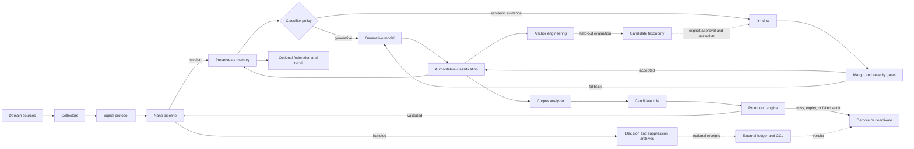

# Architecture

Cascade Compression reduces high-volume signal streams without letting the reduction mechanism
silently become the source of truth. Classification is evidence; Cascade owns the policy that
decides when that evidence is safe to use and whether a learned behavior may move into the fast
path.

## Component responsibilities

### Signal protocol and collectors

Collectors are adapters, not policy engines. They map arbitrary records into a domain-agnostic
`Signal` containing identity, type, severity, source, grouping context, labels, and an evidence
payload. The pipeline therefore works for infrastructure events, job runs, transactions, devices,
documents, or any other structured event source.

### Nano pipeline

Nano agents are deterministic and cheap. The built-in stages perform deduplication, transient
suppression, severity protection, pattern recognition, and threshold checks. Dynamically learned
agents can suppress repeated floods, dominant noise types, or context-specific noise, but only
after promotion. Every handled input receives a decision record.

### Survivor classification

Signals that remain are preserved before asynchronous classification. `CascadeClassifier` exposes
four policies:

- `generative`: use the configured model endpoint; this is the default and preserves the original
  OSS behavior.
- `compare`: run llm-d-sc and the generative classifier, record both, and keep the generative answer
  authoritative.
- `semantic`: use llm-d-sc without a generative endpoint when desired, while retaining margin and
  severity gates; errors are explicit and never converted into suppression.
- `hybrid`: use llm-d-sc when its top-two margin passes policy, otherwise fall back to the
  generative classifier.

Hybrid suppression requires a separately configurable, typically higher margin. A semantic result
that would suppress a high- or critical-severity signal is always sent to the generative fallback.
The comparison recorder exposes agreement, fallback, semantic failure, margin distribution, and
latency evidence without writing signal payloads unless an operator explicitly configures an
evidence file.

Loopback development can use plaintext gRPC. Remote llm-d-sc addresses require TLS by default, with
optional private-CA and client-certificate settings for mTLS.

### Learning and nano-agent creation

The corpus analyzer observes classification outcomes and proposes narrow deterministic rules for
repeated patterns. The promotion engine advances a rule only after it has enough evidence and no
known important misses. Once active, an agent remains reversible: sampled suppressed signals are
shadow-checked, a false negative causes immediate demotion, and the activation expires unless it
re-qualifies. This is how model judgments become nano agents without treating a model answer as
permanent truth.

### Custom anchor engineering

Classifier anchors have a separate lifecycle from nano agents. Low-margin comparison summaries can
identify where new anchors may help, but agreement between two classifiers is only proposal
evidence—not truth. `anchor_engineering.py` validates proposed phrases, produces an immutable
candidate revision, and evaluates current and candidate predictions against the same adjudicated
held-out set. Approval requires no accuracy, coverage, or per-label recall regression and zero
authoritative false suppressions. Even an approved taxonomy is not automatically activated, and
its parent revision remains the rollback target.

### Memory and federation

Surviving signals form strength-weighted memories. Recall reinforces useful memories;
consolidation weakens noise and preserves repeated important patterns. Federation can aggregate
memories from several Cascade instances while retaining source provenance. These capabilities are
optional consumers of the same signal and decision contracts, not requirements for compression.

### Governance

Cascade's in-process safety controls are always available. Independent governance is a separate
deployment choice: a ledger may store decision and promotion receipts, and GCL may audit those
receipts and return verdicts. Neither service is required to run the OSS engine or the llm-d-sc
adapter.

## Trust boundary

The semantic classifier ranks labels. Cascade decides whether the ranking is authoritative. The
corpus analyzer proposes rules. The promotion engine decides whether they may execute. Optional
governance audits those decisions independently. Keeping those responsibilities separate makes
compression measurable, inspectable, and reversible.
