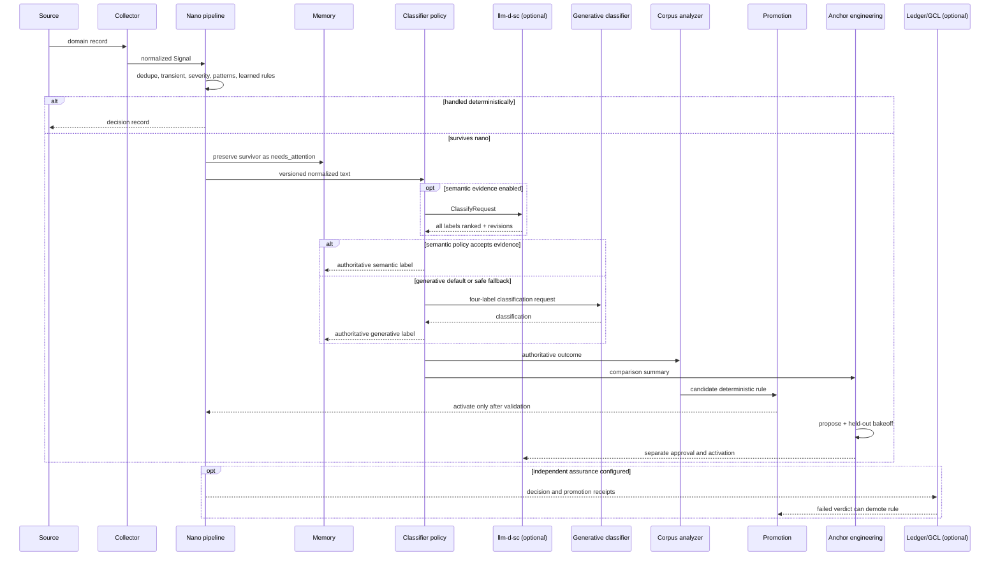

# Event Workflow

This is the end-to-end path for one event. The same path applies to any domain whose records can be
mapped to the public `Signal` contract.



## 1. Normalize at the boundary

The collector converts a source record to a `Signal`:

```python
Signal(
    signal_type="service_health",
    severity="high",
    source="example-api",
    namespace="example",
    cluster="source-a",
    content={"message": "Error rate exceeded the expected range"},
    labels={"domain": "operations"},
)
```

The contract carries evidence but does not prescribe a domain taxonomy. Collectors should avoid
making suppression decisions; that policy belongs to the cascade.

## 2. Compress in the nano tier

The pipeline evaluates the signal in ordered stages:

1. Priming may escalate a related type during a bounded attention window. It can never suppress.
2. Deduplication removes the same content inside its time window.
3. Transient and severity agents suppress only their narrow safe cases and fail open on escalation
   evidence.
4. Pattern and threshold agents add deterministic classifications.
5. Promoted dynamic agents may handle repeat floods, dominant types, or context-specific noise.

A handled signal receives a `CascadeDecision` with the agent, outcome, confidence, evidence, and
timestamp. An unhandled signal becomes a survivor.

## 3. Preserve before asynchronous work

Every survivor is written to the memory archive with `needs_attention` as its conservative initial
classification. Classification happens asynchronously, so model latency or temporary service
failure cannot erase the event. When an authoritative answer arrives, Cascade updates that exact
memory record.

## 4. Classify the survivor

Cascade serializes the survivor into a versioned text projection and normalizes variable tokens
such as UUIDs, addresses, hashes, and numeric values. This improves semantic-cache reuse while the
original structured signal remains available in memory.

The classification contract has exactly four labels:

- `routine_noise`: routine and safe to treat as noise evidence.
- `known_pattern`: familiar behavior with an established interpretation.
- `needs_attention`: unusual or ambiguous enough to investigate.
- `real_incident`: urgent, harmful, or clearly incident-level behavior.

The operator chooses a classifier policy with `CASCADE_CLASSIFIER_MODE`:

- `generative` is the default. It calls the configured micro model for low/medium severity and the
  macro model for high/critical severity.
- `compare` calls both backends, records agreement and latency, but leaves the generative answer
  authoritative. This is the recommended evaluation mode.
- `semantic` uses llm-d-sc without requiring a generative endpoint, but still applies Cascade's
  margin and severity gates.
- `hybrid` grants llm-d-sc bounded authority and uses the generative backend as fallback.

In hybrid mode, Cascade checks the top-two score margin, taxonomy revision, response status, label
set, and severity before accepting semantic evidence. Suppressive labels use a separately
configurable margin. High- and critical-severity suppressive answers always fall back. Timeouts,
unavailability, abstention, malformed responses, revision mismatch, and insufficient margin also
fall back.

The classifier records which backend was authoritative and exposes aggregate coverage, fallback,
failure, margin, agreement, and latency statistics. Payload persistence is off unless an operator
explicitly supplies `CASCADE_CLASSIFIER_EVIDENCE_FILE`.

Plaintext gRPC is accepted for loopback development only. Remote llm-d-sc endpoints require TLS by
default and can use a private CA and client certificate for mTLS.

## 5. Engineer custom anchors separately

Low-margin comparison summaries can reveal classifier coverage gaps without exporting full signal
payloads. The public anchor-engineering module supports this lifecycle:

1. Aggregate fallback patterns by signal type, label agreement, and margin.
2. Validate manually or model-proposed anchors against high-agreement proposal evidence.
3. Reject duplicate, malformed, or incident-like suppressive anchors.
4. Produce a content-addressed candidate revision with its parent and additions recorded.
5. Evaluate the current and candidate taxonomies on the same adjudicated held-out records.
6. Permit explicit approval only when accuracy, authority coverage, and per-label recall do not
   regress and there are zero authoritative false suppressions.
7. Activate the approved taxonomy as a separate operator action; restore its parent revision to
   roll back.

Classifier agreement is never described as accuracy. Accuracy requires adjudicated ground truth.
The OSS repository contains the generic mechanics and synthetic examples; operational corpora,
real anchor proposals, and environment-specific evaluation results belong outside the repository.

See [Custom Anchor Engineering](anchor-engineering.md) for the API and review checklist.

## 6. Learn candidate nano agents

Authoritative classifications feed the corpus analyzer. Repeated noise outcomes can produce a
candidate rule, but discovery is not activation. The promotion engine requires sufficient samples
and zero known important misses before a rule reaches the nano tier.

An active rule remains provisional:

- a sample of its suppressed signals is reclassified in shadow;
- one confirmed false negative demotes it immediately;
- activations expire after a configurable TTL and must re-qualify;
- an optional human approval state can be enabled;
- an optional external audit verdict can also trigger demotion.

This loop moves stable work from model-backed classification to deterministic CPU execution while
keeping the change reversible.

## 7. Retain and federate outcomes

Memory is strength-weighted and capacity-bounded. Recall reinforces useful records, consolidation
decays noise, and priming temporarily increases attention for related signal types. Optional
federation imports and exports memories across Cascade instances with source provenance intact.

Federation does not centralize the fast path: each Cascade can continue compressing locally while
an aggregate Cascade builds broader organizational context.

## 8. Add independent governance only when needed

The OSS engine includes the safety mechanics required for local operation. If an environment needs
independent receipts, a configured ledger can receive decisions, memory events, and promotion
events asynchronously. GCL can audit those receipts and return failed verdicts. Ledger or audit
failure does not block ingestion, and neither component is required for compression, memory, or
llm-d-sc integration.
